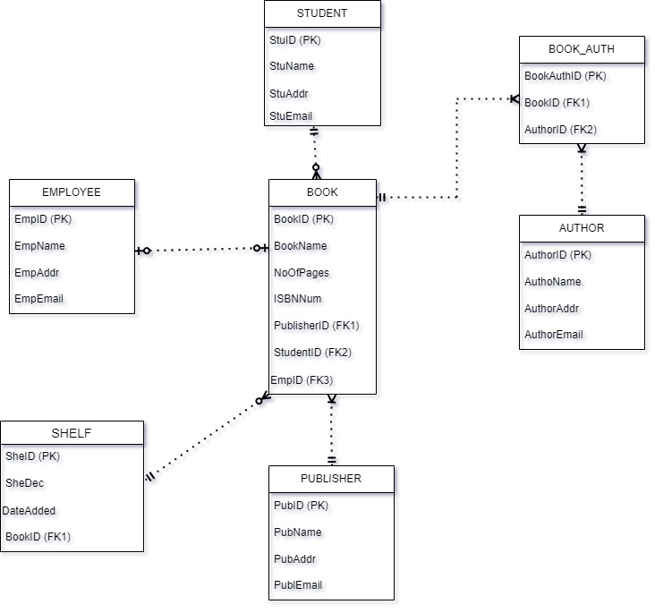
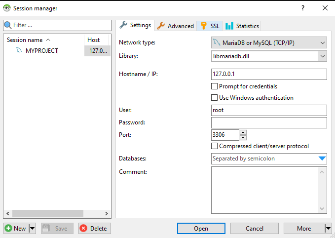
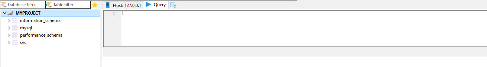
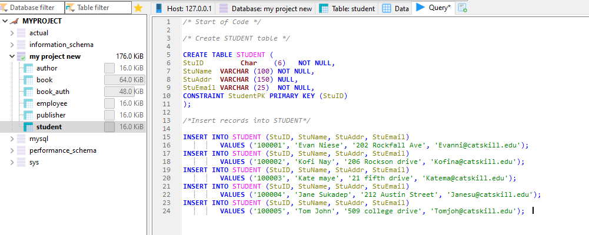
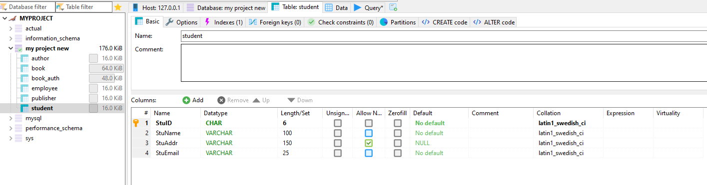
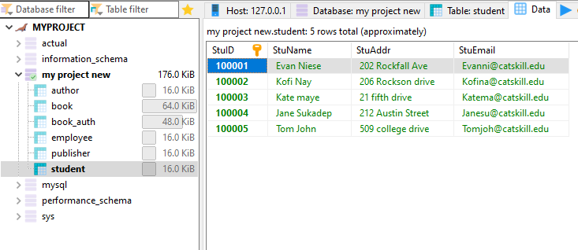
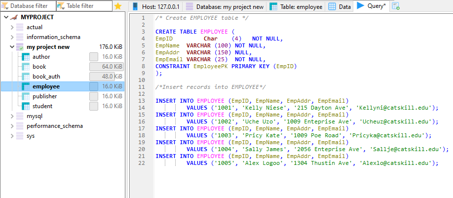
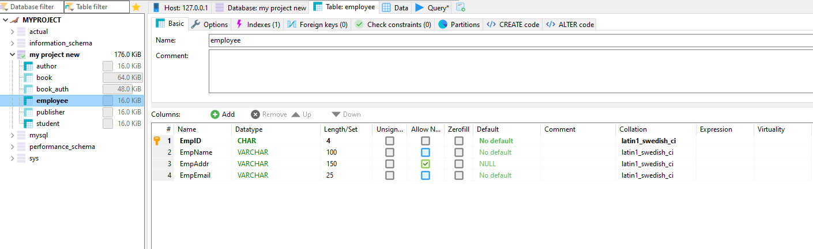
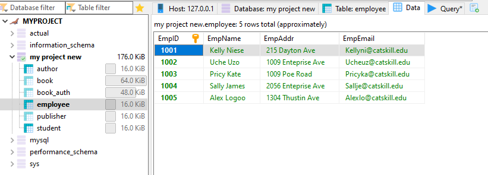

# Database-Design-and-Creation


## Table of Content
- [Project Overview](#Project-Overview)
- [Tools Used](#Tools-Used)
- [User Requirements](#User-Requirements)
- [Entities and Attributes](#Entities-and-Attributes)
- [Database Analyst User Requirement Interpretation](#Database-Analyst-User-Requirement-Interpretation)
- [Database ER Model Diagram](#Database-ER-Model-Diagram )
- [Creation of the Database](#Creation-of-the-Database)
- [Creation of the Database Entities Attributes and Values](#Creation-of-the-Database-Entities-Attributes-and-Values)
- [Coding SQL Statement to Generate reports](#Coding-SQL-Statement-to-Generate-reports)


### Project Overview
A new library has been built by a university, and a library database is needed to track the activities. The goal of this project is to design an entity relationship model for the proposed library database and create a database that stores and tracks data regarding books in the library, the authors of those books, the publishers of those books, and the students and employees who also borrow books from the library.

Note: All values are fictitious and were created with no organization in mind.

### Tools Used
- The DBMS used is MariaDB Server.
- The user interface used is HeidiSQL.
- I used Draw.io for the ER diagram model.

### User Requirements 
Requirement gathering process was conducted with the staff who worked in the library to determine their expectations from the database. 
The head of the library started by explaining the operating environment of the library as follows;
- There are multiple books authored by the same author in our collection.
- Authors may contribute to a single book or multiple books in our library.
- Some book publishers have multiple titles from their catalog featured in our library.
- Students have the option to borrow multiple books simultaneously, whereas employees are limited to borrowing one book at a time.
- Borrowing is restricted to one person per book, preventing group or team borrowings.

##### Major Reports Required:
###### Daily Reports:
- Closing staff must submit a daily report listing all borrowed books, including the names, IDs, and email addresses of the borrowers.
  
###### Monthly Stock Inventory:
- At the end of each month, a comprehensive stock inventory is conducted, encompassing all books in the library, whether currently borrowed or on the shelf.
  
###### Yearly Publisher Report:
- An annual report is compiled at the end of the academic year, providing information on all the publishers associated with the books in our library.

###### Shelf Organization:
- Our books are systematically arranged based on shelf location for ease of access and organization.

### Entities and Attributes 
##### BOOK
- Book ID
- Book Name
- No of Pages
- ISBN Number
##### AUTHOR
- Author ID
- Author Name
- Author Address
- Author Email 
##### PUBLISHER
- Publisher ID
- Publisher Name
- Publisher Address
- Publisher Email 
##### STUDENT
- Student ID
- Student Name
- Student Address
- Student Email
##### EMPLOYEE
- Employee ID
- Employee Name
- Employee Address
- Employee Email
##### SHELF
- Shelf ID
- Date Added
- Shelf Description (A to ZZ)

### Database Analyst User Requirement Interpretation
1. A book can be authored by many authors, and an author can write many books (Many-to-Many relationship).
2. A book is published by exactly one publisher, but a publisher can publish many books (Many-to-One relationship).
3. A student can borrow many books, and a book can be borrowed by exactly one student (One-to-Many relationship for students).
4. An employee can borrow at most one book, and a book can be borrowed by exactly one employee (One-to-One relationship for employees).
5. A book can at the most be on one shelf and at the least one shelf , a shelf can at the most have many books and at the least zero books. (one-to-many relationship).

### Database ER Model Diagram 
###### The construction of the database using Draw.io Workbench Model Editor



### Creation of the Database






### Creation of the Database Entities Attributes and Values
###### See raw sql codes used [here](LibraryDatabaseProjectSql_Codes.txt)

#### Student Table









#### Employee Table







#### Author Table
- [See](12.PNG) create and insert query.
- [See](13.PNG) entity and attributes.
- [See](14.PNG) new records insert.

#### Publisher Table
- [See](15.PNG) create and insert query.
- [See](16.PNG) entity and attributes.
- [See](17.PNG) new records insert. 


#### Book Table
- [See](18.PNG) create and insert query.
- [See](19.PNG) entity and attributes.
- [See](20.PNG) new records insert.

#### Book_Auth Table
- [See](21.PNG) create and insert query.
- [See](22.PNG) entity and attributes.
- [See](23.PNG) new records insert.

### Coding SQL Statement to Generate reports
###### Closing staff must submit a daily report listing all borrowed books, including the names, IDs, and email addresses of the borrowers.
```SQL Statements
SELECT BookName, EmpName, EmpEmail, StuName, StuEmail,
FROM BOOK, EMPLOYEE, STUDENT,
WHERE EmpID.BOOK = EmpID.Employee
AND StuID.BOOK = StuID.Student;
```

###### At the end of each month, a comprehensive stock inventory is conducted, encompassing all books in the library, whether currently borrowed or on the shelf.
```SQL Statements
SELECT BookName, ISBNNUM,
FROM BOOK;
```

```SQL Statements
SELECT COUNT(BookID)
FROM BOOK;
```
